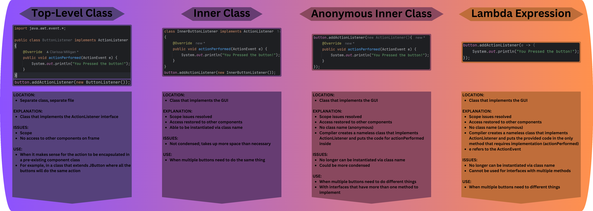

# GUI Resources
Below are some helpful links and info to help with GUI development
* [JComponent Variation Tutorials](https://docs.oracle.com/javase/tutorial/uiswing/components/index.html)
  *- These can be helpful when working with JComponent types not taught in class. Use the bar on the left to navigate 
  to the component you need help with*
* [Layout Managers](https://docs.oracle.com/javase/tutorial/uiswing/layout/index.html)
  *- Explains basic layout managers and how to pick them* 
  * [GridBagLayout](https://docs.oracle.com/javase/tutorial/uiswing/layout/gridbag.html)
    *- Can be very powerful if you know how to use it*
  * [Exact Positioning](https://docs.oracle.com/javase/tutorial/uiswing/layout/none.html)
    *- Note this should be avoided*
* [ActionListener Tutorial](https://docs.oracle.com/javase/tutorial/uiswing/events/actionlistener.html)
  *- Tutorial to help implement an ActionListener. Menu bar on the left has tutorials for other types of listeners too*
* [Graphics](https://docs.oracle.com/javase/tutorial/2d/basic2d/index.html)
  *- Draw basic shapes and images and learn formatting basics*

 

#### Graphic explaining the differences in implementation of an ActionListener:
&emsp;